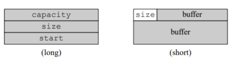
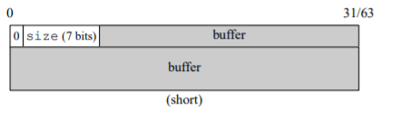
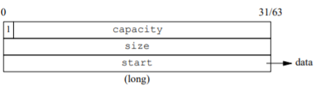

# iSTL

以学习标准库STL实现原理、C++模版编程、元编程为目的编写的简易版STL。

预计实现空间配置起、容器、适配器、迭代器以及部分算法。

目前已实现：
- 空间配置器allocator
- 容器vector、deuqe、list及其迭代器
- 容器适配器stack、queue
- 迭代器适配器reverse_iterator
- uninitialized族初始化函数
- string类及其接口

## 实现细节说明
### 空间配置器 alloc / allocator
- 空间配置器alloc底层使用malloc申请内存，并使用placement new 运算符在内存上调用需要初始化对象的构造函数
- 对于小内存 (<=128B) ，采用分离适配的方式，以大小类为依据维护成多条空闲内存块的自由链表，避免频繁调用malloc分配小内存
- alloctor是对alloc进一步封装的模板类，上层容器直接使用alloctor申请和释放内存

### string
- string采用了短字符串优化技术（Small String Optimization，SSO），参考libc++/llvm/clang的实现，采用空间利用率最高的一种SSO实现方式，在64bit机器上，本地缓存区高达22字节。该实现与机器相关，本项目基于64bit小端序机器实现。
- 对于长字符串，采用传统的eager copy方式，在堆上分配内存。
- string的内存增长策略与llvm/clang实现一致，详见`istl::string::getNewCapacity`函数注释。

string内部数据结构如下：

## 性能测试及单元测试

性能测试以标准库为基准，单元测试使用GTest编写，验证实现与标准库实现行为一致。

### vector

**数据量：1000w** 

| 操作             | std::vector (ms) | istl::vector (ms) |
| ---------------- | ---------------- | ----------------- |
| push_back        | 252.100          | 163.042           |
| access           | 0                | 0                 |
| insert at begin  | 37.7044          | 53.0964           |
| insert at middle | 16.776           | 25.672            |
| insert at end    | 0                | 0                 |
| batch insert     | 193.684          | 216.244           |
| erase at begin   | 84.0654          | 78.3162           |
| erase at middle  | 59.013           | 66.5972           |
| erase at end     | 0                | 0                 |
| batch erase      | 102.978          | 99.0688           |
| clear            | 0                | 0                 |
| pop_back         | 0                | 0                 |

**数据量：100w**

| 操作             | std::vector (ms) | istl::vector (ms) |
| ---------------- | ---------------- | ----------------- |
| push_back        | 25.4707          | 13.4007           |
| access           | 0                | 0                 |
| insert at begin  | 3.4049           | 5.266             |
| insert at middle | 1.5899           | 2.5601            |
| insert at end    | 0                | 0                 |
| batch insert     | 14.240           | 14.8551           |
| erase at begin   | 6.8213           | 6.7611            |
| erase at middle  | 5.1276           | 5.0698            |
| erase at end     | 0                | 0                 |
| batch erase      | 8.9734           | 9.1618            |
| clear            | 0                | 0                 |
| pop_back         | 0                | 0                 |

**数据量：10w**

| 操作             | std::vector (ms) | istl::vector (ms) |
| ---------------- | ---------------- | ----------------- |
| push_back        | 2.7921           | 1.4591            |
| access           | 0                | 0                 |
| insert at begin  | 0.432            | 0.6691            |
| insert at middle | 0.1847           | 0.3165            |
| insert at end    | 0                | 0                 |
| batch insert     | 1.7586           | 1.9185            |
| erase at begin   | 1.0973           | 1.0242            |
| erase at middle  | 0.7915           | 0.7801            |
| erase at end     | 0                | 0                 |
| batch erase      | 1.0126           | 1.0665            |
| clear            | 0                | 0                 |
| pop_back         | 0                | 0                 |

### deque

**数据量：1000w**

| 操作       | std::deque (ms) | istl::deque (ms) |
| ---------- | --------------- | ---------------- |
| push_back  | 299.153         | 1091.64          |
| push_front | 527.323         | 1374.08          |
| access     | 0               | 0                |
| clear      | 253.167         | 0                |
| pop_back   | 255.377         | 57.3192          |
| pop_front  | 124.511         | 69.338           |

**数据量：100w**

| 操作       | std::deque (ms) | istl::deque (ms) |
| ---------- | --------------- | ---------------- |
| push_back  | 18.7634         | 113.692          |
| push_front | 24.4703         | 114.444          |
| access     | 0               | 0                |
| clear      | 20.8797         | 0                |
| pop_back   | 19.4013         | 5.7256           |
| pop_front  | 10.3751         | 5.9401           |

**数据量：10w**

| 操作       | std::deque (ms) | istl::deque (ms) |
| ---------- | --------------- | ---------------- |
| push_back  | 2.3962          | 14.317           |
| push_front | 2.6543          | 14.1437          |
| access     | 0               | 0                |
| clear      | 0.1796          | 0                |
| pop_back   | 1.5459          | 0.7167           |
| pop_front  | 0.8656          | 0.7901           |

### list

**数据量：100w**

| 操作       | std::list (ms) | istl::list (ms) |
| ---------- | -------------- | --------------- |
| push_back  | 573.282        | 984.960         |
| push_front | 577.485        | 998.222         |
| access     | 0              | 0               |
| insert     | 0.0017         | 0               |
| erase      | 0.0005         | 0               |
| clear      | 1353.6         | 1764.3          |
| pop_back   | 503.495        | 831.038         |
| pop_front  | 854.853        | 875.957         |
| splice     | 0              | 463.229         |
| remove     | 17.5232        | 507.249         |
| unique     | 514.187        | 2003.36         |
| merge      | 20.2024        | 1927.83         |
| sort       | 11551.5        | 128462          |
| reverse    | 2054.5         | 2569.59         |

**数据量：10w**

| 操作       | std::list (ms) | istl::list (ms) |
| ---------- | -------------- | --------------- |
| push_back  | 65.4247        | 80.2646         |
| push_front | 72.7535        | 77.851          |
| access     | 0              | 0               |
| insert     | 0.0024         | 0               |
| erase      | 0.0003         | 0               |
| clear      | 154.825        | 143.157         |
| pop_back   | 60.1328        | 70.6258         |
| pop_front  | 95.4812        | 70.0446         |
| splice     | 0              | 40.7983         |
| remove     | 1.767          | 40.9219         |
| unique     | 57.4371        | 155.756         |
| merge      | 2.0643         | 162.891         |
| sort       | 558.344        | 8900.99         |
| reverse    | 125.341        | 231.669         |

**数据量：1w**
| 操作       | std::list (ms) | istl::list (ms) |
| ---------- | -------------- | --------------- |
| push_back  | 7.23555        | 3.49065         |
| push_front | 7.22295        | 4.01985         |
| access     | 0              | 0               |
| insert     | 0.0005         | 0               |
| erase      | 0.00005        | 0               |
| clear      | 14.9949        | 6.487           |
| pop_back   | 6.014          | 3.20425         |
| pop_front  | 8.3887         | 3.50095         |
| splice     | 0              | 1.1034          |
| remove     | 0.1583         | 1.1097          |
| unique     | 4.1031         | 6.00735         |
| merge      | 0.1449         | 4.34845         |
| sort       | 23.9327        | 217.333         |
| reverse    | 6.8625         | 9.2808          |